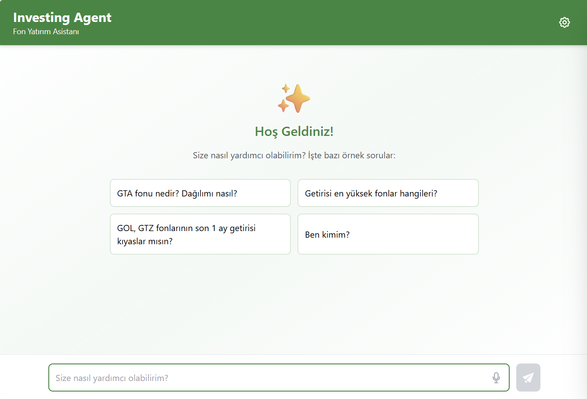
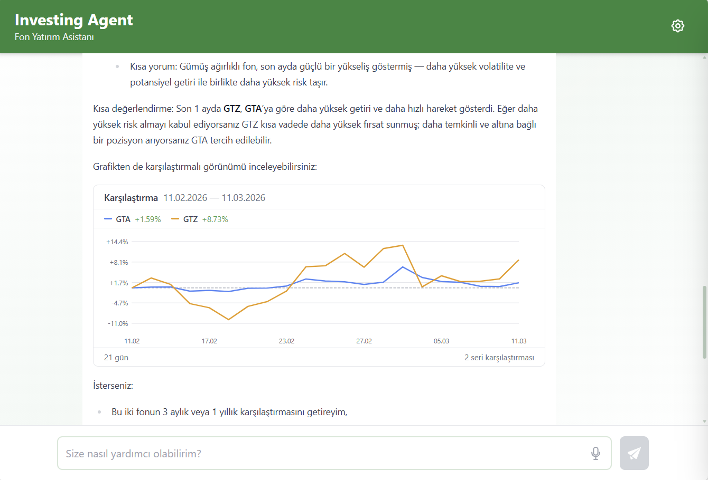
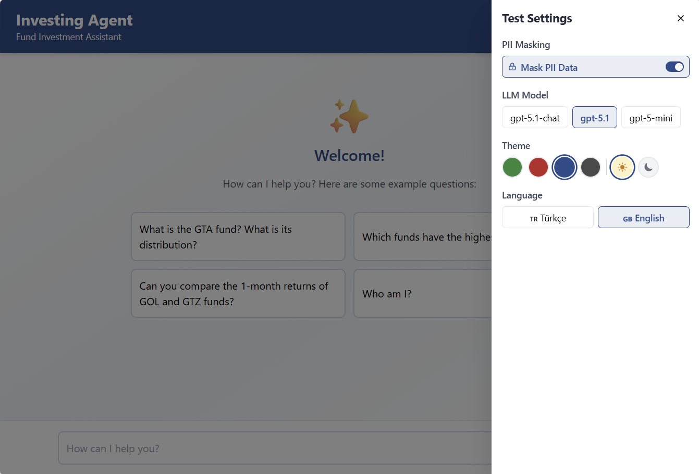

# MAF Demo App

Multi-agent investment asistant solution built with **Microsoft Agent Framework** (`agent-framework-core`), **FastAPI**, and **Next.js**.

Uses Azure OpenAI models (GPT-5.1) with function calling, multi-agent handoff (Workflow), and OpenTelemetry instrumentation provided by the framework.

## Screenshots

| Home | Chat | Settings |
|------|------|----------|
|  |  |  |

## Tech Stack

| Layer | Technology |
|-------|-----------|
| Agent Framework | `agent-framework-core`, `agent-framework-azure` |
| Backend | Python 3.11, FastAPI, SSE streaming |
| Frontend | Next.js 14, Tailwind CSS |
| LLM | Azure OpenAI GPT-5.1 |
| Observability | OpenTelemetry (agent_framework.observability) |

## Prerequisites

- Python 3.10+
- Node.js 18+
- Azure OpenAI resource with GPT-5.1 deployment

## Run Locally

### Backend

```powershell
cd backend
python -m venv venv
.\venv\Scripts\Activate.ps1
pip install --pre -r requirements.txt

cp .env.example .env
# Edit .env with your Azure credentials

python main.py
# → http://localhost:8000
```

**Required env vars** (`.env`):

```
AZURE_OPENAI_ENDPOINT=https://your-resource.openai.azure.com/
AZURE_OPENAI_KEY=your-key
AZURE_OPENAI_DEPLOYMENT=gpt-5.1
AZURE_OPENAI_API_VERSION=2024-02-15-preview
```

### Frontend

```powershell
cd frontend
npm install

cp .env.example .env.local
# NEXT_PUBLIC_API_URL=http://localhost:8000

npm run dev
# → http://localhost:3000
```

## Docker

```powershell
docker build -t maf-demo-app .
docker run -p 8000:8000 --env-file backend/.env maf-demo-app
# → http://localhost:8000
```

## Project Structure

```
├── backend/
│   ├── main.py                  # FastAPI + SSE endpoints
│   ├── agent/
│   │   ├── investment_agent.py  # Main ChatAgent (MAF)
│   │   ├── currency_agent.py    # Currency sub-agent (handoff)
│   │   └── customer_info_agent.py # Customer sub-agent (handoff)
│   ├── tools/                   # Tool functions
│   └── requirements.txt
├── frontend/
│   └── app/
│       ├── page.tsx             # Chat UI
│       └── globals.css          # Theme (CSS variables)
├── Dockerfile                   # Multi-stage build
└── README.md
```

## API

| Method | Endpoint | Description |
|--------|----------|-------------|
| `POST` | `/chat/stream` | SSE streaming chat |
| `POST` | `/chat` | Non-streaming chat |
| `GET` | `/user/me` | Current user info |
| `DELETE` | `/session/{id}` | Clear session |
